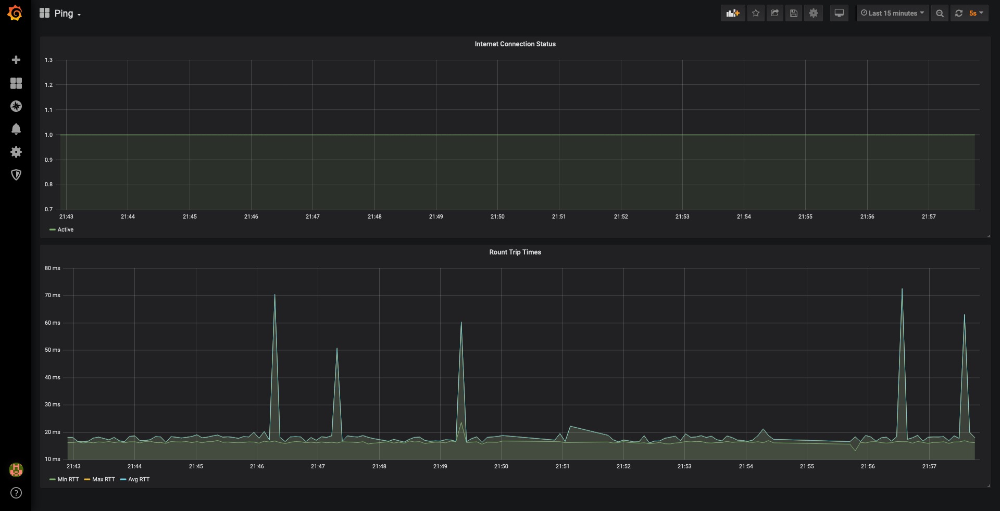

# Ping Monitor



A simple application to monitor network uptime at home.
This setup starts three docker containers.
Grafana for UI, InfluxDB as storage and a python docker container,
containing a small skript which sends ICMP pings and stores the results in the InfluxDB.

## Prerequisites

* Docker
* Docker Compose
* Python 3

## Installation

1. Clone Repository
2. Run ```python3 generate.py```
3. Run ```docker-compose up -d```
4. Open Grafana `http://localhost:3000`
5. Use the credentials to login into grafana from the generate .env file in the root of the repository

## Metrics

Currently following metrics are supported:
- active: Flag which indicates if a connection was possible 
  - 0: connection failed
  - 1: connection was ok
- round_trip_time_max: Longest running ping in a batch (in ms)
- round_trip_time_min: Shortest running ping in a batch (in ms)
- round_trip_time_avg: Average RTT for a batch (in ms)

## Used Libraries

- https://github.com/influxdata/influxdb
- https://github.com/alessandromaggio/pythonping
